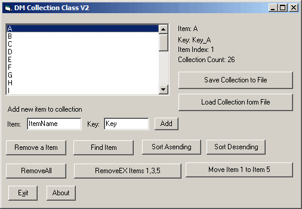



## DM Custom CollectionCass 2

### Description

I have updated my custom collection class form version 1 fix some little bugs, now added compare options for when seraching items and keys, added sorting support, added new Remove feature that allows you to delete item form a paramarray, added MoveTo to feature to move items around the collection, Key Detection has now been added like the normal vb one and more.

hope you find it usfull.
 
### More Info
 

             |
---                |---
**Submitted On**   |2005-07-31 00:43:42
**By**             |[dreamvb](https://github.com/Planet-Source-Code/PSCIndex/blob/master/ByAuthor/dreamvb.md)
**Level**          |Beginner
**User Rating**    |4.6 (23 globes from 5 users)
**Compatibility**  |VB 6\.0
**Category**       |[Object Oriented Programming \(OOP\)](https://github.com/Planet-Source-Code/PSCIndex/blob/master/ByCategory/object-oriented-programming-oop__1-47.md)
**World**          |[Visual Basic](https://github.com/Planet-Source-Code/PSCIndex/blob/master/ByWorld/visual-basic.md)
**Archive File**   |[DM\_Custom\_1919267312005\.zip](https://github.com/Planet-Source-Code/dreamvb-dm-custom-collectioncass-2__1-61995/archive/master.zip)

